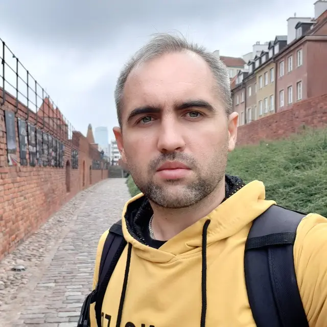

# Igor Dermanowski

## Contacts
* Email: scriptex88@gmail.com
* Telegram: [@skr1ptex](https://t.me/skr1ptex)

## Experience

### 2025 — present
*Web developer/Webflow developer (Freelance)*

*ITCH (Teacher)*

Developing websites, integrating APIs and optimizing performance. Teaching Webflow at IT Career Hub.

### 2024 — 2025
*Webflow developer (Mira)*

Built CMS features, filtering and UTM tracking with Finsweet and JavaScript. Mentored Webflow developers.

### 2022 — 2024
*Webflow developer/Web designer (Freelance)*

Designed and built Webflow websites with CMS, SEO, CRM integrations and workflow automation.

## Education

Bachelor of Jurisprudence · 2010–2014
**Manash Kozybayev North Kazakhstan University**

## Sills

* HTML
* CSS
* JavaScript
* Webflow
* Astro
* Figma
* N8N
* Git/GitHub
* Dokploy

## Language

* Russian - *Native*
* Polish - *B1*
* English - *A1*

## Interests

* *3D CAD*
* *3D print*
* *Electronics*